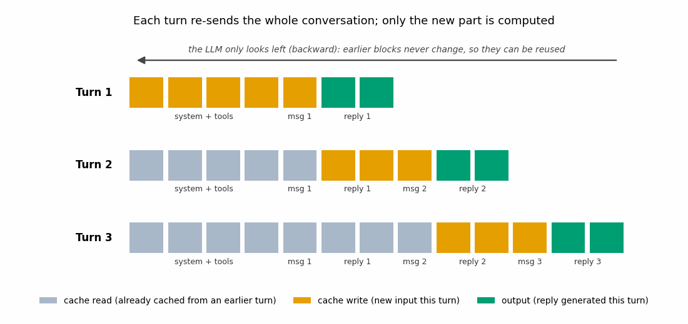

# How pricing works with Claude Code

## Introduction
My company sets a hard limit on how much each of us can spend on AI tools. Even without one, I think it's worth using these tools efficiently: every token is compute, and compute costs both money and energy.

This is an evolving space, and companies are rolling out their own ways of capping spend so they don't end up like some of the early "token-max" companies:

- **Uber (reported Apr–Jun 2026):** burned its entire 2026 AI coding budget in ~4 months after Claude Code use went from 32% → 84% of ~5,000 engineers. Reported per-engineer spend was $150–$250/mo on average and $500–$2,000/mo for power users, with one reported $1,200 two-hour session. Uber then capped agentic coding tools (Claude Code, Cursor) at **$1,500/mo per employee per tool**. The total budget figure isn't disclosed. ([TechCrunch, 2026-06-02](https://techcrunch.com/2026/06/02/uber-caps-employee-ai-spending-after-blowing-through-budget-in-four-months/), [Fortune, 2026-05-26](https://fortune.com/2026/05/26/uber-coo-ai-spending-tokens-claude-code/), [Yahoo Finance](https://finance.yahoo.com/technology/ai/articles/uber-blew-entire-2026-ai-145000897.html))
- **Microsoft (reported spring 2026):** rolled Claude Code out to engineers in Dec 2025, then reportedly wound it down, with a migration to GitHub Copilot CLI by 2026-06-30. Secondary sources cite ~5,000 engineers and ~$2,000/engineer/mo once usage-based billing kicked in, but I couldn't confirm those figures against a primary source. ([The Next Web](https://thenextweb.com/news/microsoft-claude-code-retreat-ai-cost), [Enterprise DNA](https://enterprisedna.co/resources/news/microsoft-claude-code-enterprise-budget-overrun-2026/))
- **Coinbase:** the CEO reports keeping AI costs flat despite exponential usage growth by routing prompts to cheaper models. ([SmarterX](https://smarterx.ai/smarterxblog/ai-token-budgets-uber-microsoft))

So whether it's a budget you've been told to stay under, or you simply want to use the bigger models for whatever your work needs, you're going to need to know how to stay under it. I'd argue that using Opus the right way can make it up to an order of magnitude cheaper than using Sonnet carelessly: in the worked example below, a warm Opus 5.5 turn costs $0.05, while a cold-cache Sonnet turn costs $0.41–$0.62 (~8–12×). So I don't envy my SWE friends bragging about how much Sonnet they're able to use. For DS we simply need Opus for a lot of our stats and exploratory work (another blog on that at some point).

**Note for subscription users**
This is written mostly for enterprise (pay-per-token), but a personal Pro/Max plan works very similarly: you get a budget within a window, and the size of that budget isn't disclosed to you. Knowing how the enterprise billing works still helps you stay under your limits and use Opus for longer.

- **Two limits:** a session limit that resets every 5 hours, plus a weekly limit with a fixed reset time for your account. ([limits in Claude Code](https://support.claude.com/en/articles/14552983-models-usage-and-limits-in-claude-code))
- **Budget units:** it's a "conversation budget", not dollars. What drives it is message length, file sizes, conversation length, tool use, model and effort level. ([usage limit best practices](https://support.claude.com/en/articles/9797557-usage-limit-best-practices))
- **Cold cache applies here too:** cache reads count for less, and re-caching expired content counts in full. (same source)
- **Models on Pro:** Opus 5.5 is included; Fable 5.1 needs pay-as-you-go credits. ([Fable on your plan](https://support.claude.com/en/articles/15424964-claude-fable-models-on-your-plan))
- **Checking usage:** `/status` in the CLI, or Settings > Usage on web/desktop.

## mechanics of the api calls

The LLM (Claude) runs on Anthropic's servers, a supercomputer far, far away. CC talks to it over an API, which just means sending it a request and getting a response back.

The first concept, how an LLM writes:

1. It reads the entire history so far.
2. It predicts the **next token** (roughly a word fragment).
3. That token is appended to the history.
4. Back to step 1, until the reply is done.

Every reply, thinking included, is built this way, one token at a time.

The LLM keeps no memory between requests, so every request carries the full conversation (system prompt, tools, all prior messages, your new message). What makes this affordable is the prompt cache.

1. **You send a message.** CC sends the whole conversation plus your new message to Anthropic.
2. **Anthropic checks the cache.** The cache holds the model's saved values (activations) for every token already in the history. The LLM only looks backward, so new text never changes them and they can be reused as-is. Any of the conversation processed in the last hour is a **cache read**: that compute is skipped, so it's billed at 0.05–0.1× base input. Each read resets the 1-hr timer.
3. **New tokens get cached.** Your message and the previous reply are a **cache write** (2× base input: computed *and* stored). So the previous reply isn't billed as plain input. If the cache expired, or something early in the conversation changed (system prompt, tools, effort level), the *whole* conversation is a write (cold turn).
4. **The model generates.** Thinking, then the reply or a tool call, all **output** (the most expensive rate).
5. **Tool call? Back to step 1.** CC runs the tool and sends a new request with the result. One message from you can be many requests, each re-reading the cache.

*Each turn re-sends the whole conversation, growing from 7 blocks in Turn 1 to 13 blocks in Turn 3. Only the previous reply and the new message are written to the cache, and only the new reply is generated. Everything earlier is read back from the cache unchanged.*

## The pricing model for typical CC usage

Every turn re-sends the whole conversation. What you pay depends on whether that prefix is still in the prompt cache ([pricing](https://platform.claude.com/docs/en/about-claude/pricing), [prompt caching](https://code.claude.com/docs/en/prompt-caching.md)):

- **Cache read:** everything already cached and still within its TTL. This is the bulk of every turn.
- **Cache write (1-hr TTL):** the new tokens each turn (your message plus the previous reply). Also the *entire* prefix if the cache has expired.
- **Plain input:** tokens outside the cached prefix, ~2/turn in CC (effectively zero).
- **Output:** what the model generates.

Claude Code uses the 1-hr TTL (verified 2026-09-25 from a session transcript: `cache_creation` shows only `ephemeral_1h_input_tokens`).

**Worked example:** a 100K-token conversation, warm cache. I send a 200-token message; the previous reply was ~1,000 tokens (so 1,200 new tokens get written); the model replies with 1,000 tokens.

| Per turn | Tokens | Sonnet 4.6 | Sonnet 5 | Opus 4.1 | Opus 5 | Opus 5.5 | Fable 5 | Fable 5.1 |
|---|---|---|---|---|---|---|---|---|
| Cache read | 100,000 | $0.030 | $0.020 | $0.150 | $0.050 | $0.020 | $0.100 | $0.025 |
| Cache write (1-hr) | 1,200 | $0.007 | $0.005 | $0.036 | $0.012 | $0.010 | $0.024 | $0.024 |
| Plain input | ~2 | ~$0 | ~$0 | ~$0 | ~$0 | ~$0 | ~$0 | ~$0 |
| Output | 1,000 | $0.015 | $0.010 | $0.075 | $0.025 | $0.020 | $0.050 | $0.050 |
| **Total (warm)** | | **$0.052** | **$0.035** | **$0.261** | **$0.087** | **$0.050** | **$0.174** | **$0.099** |
| **Same turn, cold cache** (101.2K written) | | **$0.62** | **$0.41** | **$3.11** | **$1.04** | **$0.83** | **$2.07** | **$2.07** |
| Cold ÷ warm | | 12× | 12× | 12× | 12× | 17× | 12× | 21× |

Rates, $/MTok:

| Model | Base input | 1-hr write | Cache read | Output |
|---|---|---|---|---|
| Sonnet 4.6 | 3 | 6 | 0.30 | 15 |
| Sonnet 5 | 2 | 4 | 0.20 | 10 |
| Opus 4.1 (retired) | 15 | 30 | 1.50 | 75 |
| Opus 5 | 5 | 10 | 0.50 | 25 |
| Opus 5.5 | 4 | 8 | 0.20 (0.05×) | 20 |
| Fable 5 | 10 | 20 | 1.00 | 50 |
| Fable 5.1 | 10 | 20 | 0.25 (0.025×) | 50 |

- **Per generation:** newer models are cheaper per warm turn. Opus 4.1 → 5 → 5.5 is $0.26 → $0.09 → $0.05, and Fable 5 → 5.1 is $0.17 → $0.10. Most of the drop comes from cheaper cache reads (Opus 5.5 at 0.05×, Fable 5.1 at 0.025×, vs the standard 0.1×).
- **Opus 5.5 vs Sonnet:** a warm Opus 5.5 turn ($0.050) costs about the same as Sonnet 4.6 ($0.052) and ~1.4× Sonnet 5 ($0.035). Opus 5.5 and Sonnet 5 cache reads are the same price, so the gap comes only from writes and output.
- **Tokenizer caveat:** 4.7+ models use a tokenizer that produces ~30% more tokens for the same text (per the pricing page). For identical text, Sonnet 4.6 would see fewer tokens (~$0.040/turn, inferred), so treat the Opus 5.5 ≈ Sonnet 4.6 point as approximate.
- **Cold cache:** a cold turn costs 12–21× a warm one on every model. Models with discounted cache reads (Opus 5.5, Fable 5.1) have the most to lose. The cache state is the lever, far more than the model.
- **Token counts:** the counts are a constructed example; the rates are from the [pricing page](https://platform.claude.com/docs/en/about-claude/pricing) as of 2026-09-25.

## thinking mode

Thinking doesn't add extra turns. The model writes its thinking and its reply in a single generation, token by token, so by the time it writes the first word of the reply, all the thinking is already in context. That's also why it helps: more tokens before the answer means more compute and a scratchpad for intermediate steps. ([Steering thinking](https://platform.claude.com/docs/en/build-with-claude/thinking-steering-and-cost))

Where it costs you:

- **Billed as output tokens,** the most expensive rate ($20/MTok on Opus 5.5).
- **You pay for the full thinking, not what you see.** CC shows a summary; the bill counts every raw thinking token (`usage.output_tokens_details.thinking_tokens`).
- **It stays in context.** Opus 4.5 and newer keep earlier turns' thinking and bill it as input. It gets written to cache on the next turn, then read on every turn after that.
- **Changing effort mid-session breaks the cache.** The effort level is part of the cached prompt, so switching it makes the next turn a cold-cache turn (12–21×, see above). Pick one level per session.

**Worked example (Opus 5.5):** a turn with 5,000 thinking tokens, on top of the $0.050 warm turn above.

| Cost | Tokens | Rate ($/MTok) | Cost |
|---|---|---|---|
| Thinking output (this turn) | 5,000 | 20 | $0.100 |
| Cache write (next turn) | 5,000 | 8 | $0.040 |
| Cache read (every turn after) | 5,000 | 0.20 | $0.001 |

That turn costs $0.15, **3×** the non-thinking turn. The carry-forward is small once it's cached. For scale, 300 thinking tokens on a quick question is $0.006, which is noise.

**The dial:** effort level (low / medium / high / xhigh / max). Thinking is adaptive: the model decides per request whether to think at all. Opus 5.5 defaults to `medium` and often skips thinking on simple questions. In tool loops, most of the thinking happens on the first request after your message.

## interesting test 1

how expensive is it to say hi with varying amount of org level system prompting

## interesting test 2

cold starting a session after a long meeting plot cost vs context length (again point to reseeding doc)

show that the extension actually has a timer for you to know this

## interesting test 3

keeping a session open assuming - best to start a new one and reseed it (I write a blog where i discourage those i mentor from doing things like keeping)

## interesting test 4
why the 5 series were so expensive